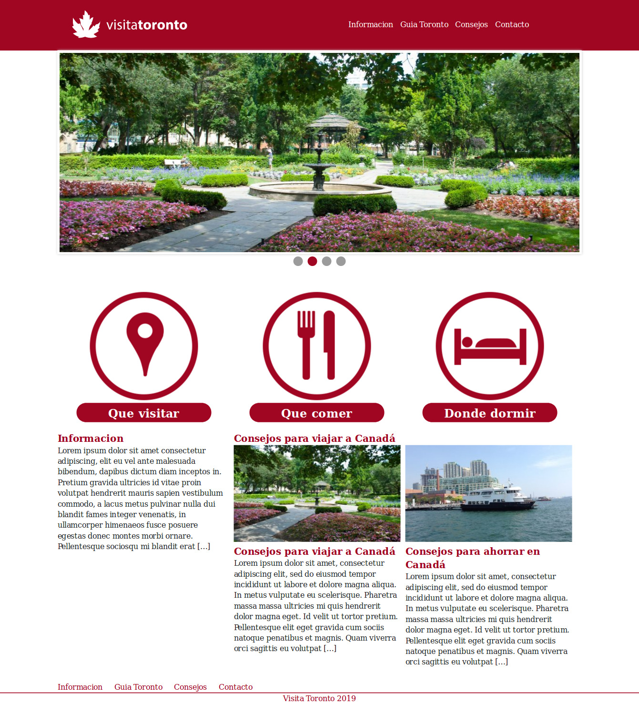
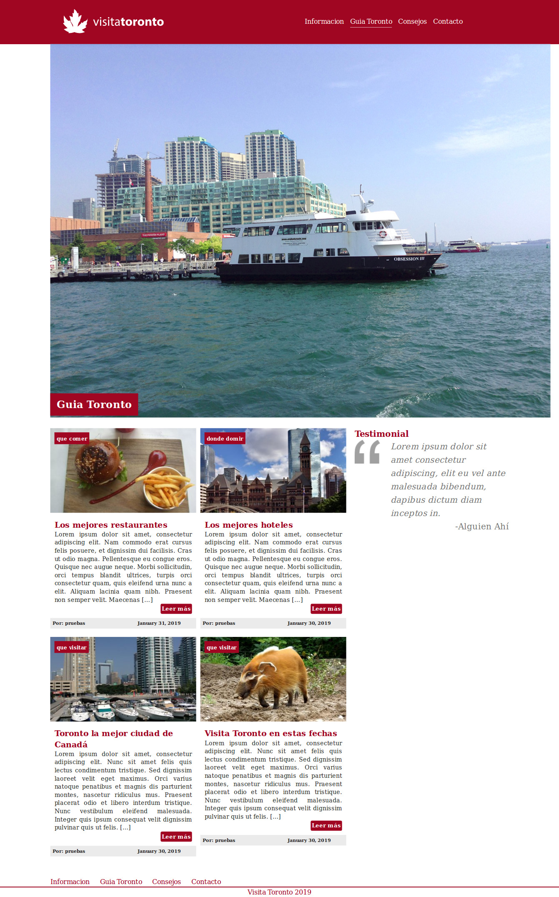
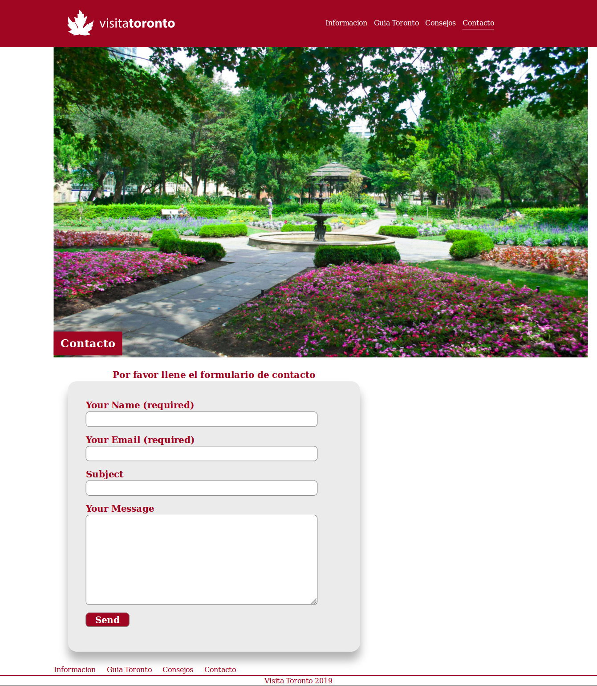
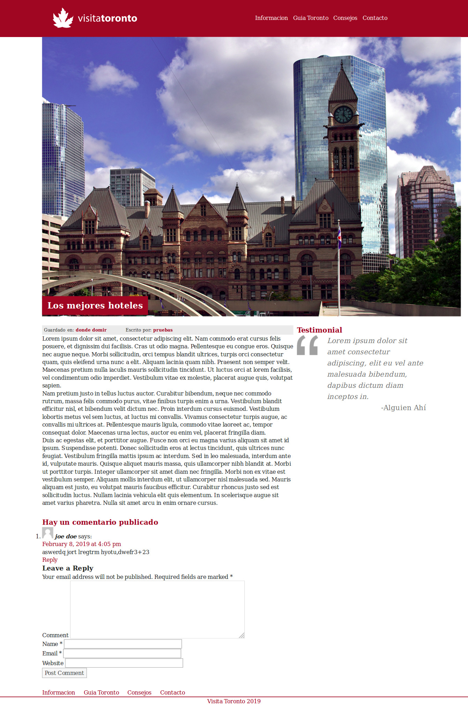

WordPress Theme: Toronto (visit Toronto)
==================

A WordPress theme I´ve made to practice, it was inspired on Toronto, it have basic features like: a static home page, a blog page (guia Toronto), single post page, 
and contact page, it also have suppor to chage the favicon and featured images on post and static pages.   

To install it you just have to follow this stepts (the usuals when you are installing another WP theme):

~~~
1) Download the .zip with the theme.
2) click on add theme. 
3) Click on Upload Theme. 
4) Choose the .zip that content the theme.
5) Click on Install now.
6) Preview or activate the theme.
~~~
 

